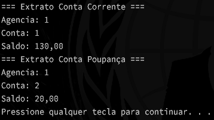

# Desafio DIO Banco

Esta aplicação é um projeto de desafio da DIO que simula as operações básicas de um banco. Utilizando conceitos básicos dos 4 pilares da programação orientada a objetos (POO), a aplicação permite:

- Criar contas bancárias
- Realizar depósitos
- Efetuar saques
- Transferir valores entre contas

O objetivo é aplicar conceitos de programação orientada a objetos e boas práticas de desenvolvimento.

## Tecnologias Utilizadas

- Java

## Como Executar

1. Clone o repositório.
2. Navegue até o diretório do projeto.
3. Compile e execute a aplicação utilizando seu ambiente de desenvolvimento Java preferido.

